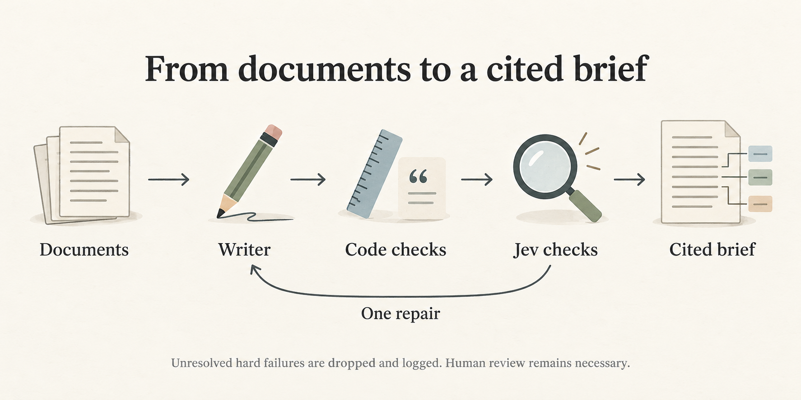

# Company research brief agent

**Project by [keshav0479](https://github.com/keshav0479)** · [Original repository](https://github.com/keshav0479/research-brief-agent) · [Attribution notice](NOTICE)


Give the agent an NSE ticker and company documents. It produces a short Markdown research brief with Snapshot, Bull case, Bear case, Open questions and Sources. The local web workspace lets a reader inspect the passages behind each claim and review possible omissions.

**Prepared submission brief:** [SRVCABLE, as of 23 September 2026](submission/brief.md). This is an exact copy of the unedited `v6.1-reference-d-01` output: 397 body words, 15 retained claims. Owner sign-off and submission are pending. [Submission checklist](SUBMISSION.md) explains the remaining steps.

**Prepared demo:** [Watch the 2:50 narrated walkthrough](submission/demo.mp4) · [Transcript and production disclosure](submission/VIDEO.md). Edited real app screenshots with Kokoro synthetic narration; saved-run demonstration, owner review pending.

## Run locally

Use Python 3.12 and `uv`:

```bash
uv venv --python 3.12
uv pip install --python .venv/bin/python -r requirements.txt
.venv/bin/python -B -m research_ui --port 8765
```

Open http://127.0.0.1:8765. Saved reports work without keys. Select a claim for its evidence; use **Coverage** for possible omissions and **Runs** for earlier attempts, including failures. This is a local application, not a hosted service.

Place the eight assessment Markdown documents directly in `research_pack/`. They are intentionally excluded from the repository. `pack-hashes.json` identifies the original pack. Saved report text remains readable without it, but passage inspection requires the exact source bytes and parser version recorded by the run.

For a new run, copy `.env.example` to `.env` and set `WRITER_API_KEY`, or export `GROQ_API_KEY` privately before starting the server. The UI offers an explicit free Zen decision route and a TypeSafe reference route. The latter requires `TYPESAFE_API_KEY` exported in the server environment. The browser never receives API keys. New-run documents are sent to the selected providers.

The CLI uses the same engine:

```bash
.venv/bin/python -B -m brief_agent --ticker SRVCABLE --docs research_pack --as-of 2026-09-23 --label my-first-run
```

Use a fresh label. To select the reference verifier explicitly, export these before the CLI command:

```bash
export JEV_URL=https://api.typesafe.ai/v1/systemone
export JEV_MODEL=jev-1.13.0
export JEV_API_KEY="$TYPESAFE_API_KEY"
```

The assignment date is passed explicitly. There is no live NSE lookup, web collection or PDF import. [WEB-WORKSPACE.md](WEB-WORKSPACE.md) documents Markdown upload format and the local UI.

## Design and models



*Conceptual illustrations generated with AI. They depict the workflow, not screenshots or evidence of factual accuracy.*

The writer is Groq `qwen/qwen3.8-27b`, using strict JSON, temperature 0.2 and reasoning disabled. It generates claims with passage IDs. Code copies the corresponding evidence, checks citations, numbers and dates, and rejects investment-advice wording. Jev checks support and statement type; claims based on lower-tier sources also face contradiction checks against primary sources. One repair is allowed, then unresolved hard failures are dropped and logged.

Jev defaults to OpenCode Zen `jev-1.13-free`; reference runs explicitly use TypeSafe `jev-1.13.0`. We chose structured writing plus a separate decision model to make each stage inspectable and keep deterministic work in code. The saved comparison does **not** establish that Jev produces better content than an LLM checker. An early LLM-checker brief was judged more complete in independent review. Observed times include provider waits.

The separate files [writer system prompt](prompts/system.md), [repair prompt](prompts/repair.md), and [decision questions and thresholds](prompts/jev_questions.json) define the current behavior. The design adapts TypeSafe's [citation-check](https://docs.typesafe.ai/cookbooks/citation_check.md) and [entity-alignment](https://docs.typesafe.ai/cookbooks/entity_alignment.md) patterns.

## Evidence and limitations

[TESTLOG.md](TESTLOG.md) records design changes, failures and fixes. [METRICS.md](METRICS.md) summarizes all 33 saved attempts. A writes directly; B adds code checks; C uses the writer model for semantic decisions; D uses Jev. The twelve-run v2 matrix is a fixed comparison; later versions are separate development evidence. Raw outputs, checks, returned model IDs, source hashes and code snapshots are retained. Source requests are hashed rather than redistributed in raw request bodies.

The prepared brief was selected for its current-engine provenance, revenue-growth coverage and contract price-lag risk. It omits profit growth and revenue guidance, its data-centre doubling referent could be clearer, and two statement types remain unconfirmed. The UI exposes these review needs. No generated brief has been manually edited. See [selection record](submission/selection.json).

Provider availability varies. The last current-code free-route attempt could not verify the pack because the provider requested a roughly five-hour wait. Earlier free runs worked; the submission candidate uses TypeSafe. Of the two later UI runs, one failed writer JSON validation and one completed after a repair and rate-limit wait. Transport retries are bounded, and there is no automatic paid fallback. The configured Gemini alternative has not been tested.

Mechanical checks and model scores are not accuracy guarantees. Coverage uses topic keywords and numeric tokens, not a semantic completeness test. Tiers trust supplied metadata; a date match alone does not establish an event date. The defense against the supplied hidden instruction is not evidence of resistance to arbitrary attacks. Actual billing, human accuracy labels and sealed evaluation results are not claimed.

## Verify and demonstrate

```bash
.venv/bin/python -B -m unittest discover -s tests -q
node --test tests/test_web_ui.mjs
```

Node is only needed for the browser-state tests, not to serve the application. Tests run offline and use local fixtures. The [recording guide](DEMO.md) covers the required 2–3 minute demonstration. The [submission checklist](SUBMISSION.md) separates assignment requirements from our additional owner checks.
